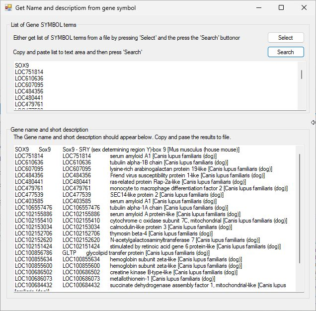

# Get_LOC user guide

Get_LOC is written in C# which is targeted to the WIndows environment, but it can run on Linux, BSD and macOS computers using Wine as described [here](https://github.com/msjimc/RunningWindowsProgramsOnLinux). 

# User interface
Get_LOC's primary interface consists of two regions: the upper panel consists of a text area below to buttons, while the lower panel consists of a single large text area (Figure 1)

Figure 1

## Entering the terms

A list of SYMBOL terms or accession ID can be either copied and pasted in to the upper text area (one term per line) or extracted from a text file by pressing the **Select** button. 

### Entering terms from a file

**Acceptable file formats**:
Just about any character delimited text file is acceptable as long as the individual data columns are separated be a single character. For example *.csv files use a ',' to separate columns while a tab delimited text file uses a <tab> character.   

Pressing the **Select** button displays the **Get SYMBOL terms from file** form (Figure 2).  

Figure 2

A data file can be selected by pressing the **Select** file, once imported, the first 10 lines of the file are displayed in the text area (Figure 3). The small text area below the **Select** button will now be active.

Figure 3

To split the data lines in to individual columns, enter the separating character in the small text area. In this case the data file is a csv formatted file and so a ',' is entered. If the file is a tab delimited file, enter '\t' (without the speech marks). This will active the number control below the small text area and split each line in to a series of columns. SInce the value in the number control is now '1', only the text in the first column is now shown in the lower text field (Figure 4)

Figure 4

To select the appropriate data fields change the value in the number control and press enter. In this case the gene SYMBOL value is the ninth column (Figure 5) while the RefSeq ID's or the second (Figure 6)

Figure 5

Figure 6

Once the desired column has been selected press the **Accept** button to import the terms into the primary form (Figure 7)

Figure 7

## Processing the terms

Whether the terms were copied and pasted or imported from a file, pressing the **Search** button will prompt **Get_LOC** to interrogate the NCBI Gene website for related gene names and short descriptions. The extracted data will appear in the lower text area as a tab delimited list' The first value is the search term, followed by the gene's name as suggested by the first hit from the NCBI site and finally a short description plus the species the data is linked too (Figure 8).

**Note**: if the data is from a file, you may need to delete the first term as it may be either a empty line or the column title. 

Figure 8

Once the list has been processed, it can be copied and pasted in to the required documents.