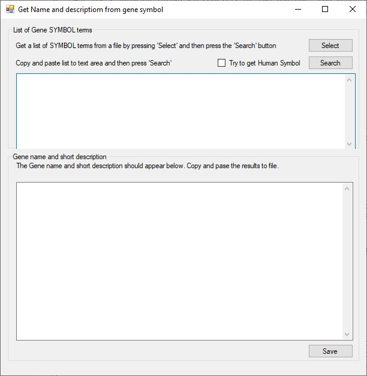

# Get_LOC user guide

Get_LOC is written in C#, targeting the Windows environment. However, it can run on Linux, BSD and macOS computers using Wine as described [here](https://github.com/msjimc/RunningWindowsProgramsOnLinux). 

# User interface
Get_LOC's primary interface consists of two regions: the upper panel holds a text area below two buttons, while the lower panel consists of a single large text field (Figure 1).

Figure 1

## Entering the terms

A list of SYMBOL terms or RefSeq accession ID can be either manually copied and pasted in to the upper text area (one term per line) or extracted from a text file by pressing the **Select** button. 

### Entering terms from a file

**Acceptable file formats**:
Just about any character delimited text file is acceptable as long as the individual data columns are separated by a single character. For example *.csv files use a ',' to separate columns while a tab delimited text file uses a <tab> character.   

Pressing the **Select** button displays the **Get SYMBOL terms from file** form (Figure 2).  

Figure 2

A data file can be selected by pressing the **Select** file on the **Get SYMBOL terms from file** form. Once imported, the first 10 lines of the file are displayed in the text area (Figure 3) and the small text area below the **Select** button will now be active.

Figure 3

To split the data lines in to individual columns, enter the separating character in the small text area. In this case the data file is a csv formatted file and so a ',' is entered. If the file was a tab delimited file, enter '\t' (without the speech marks). This will active the number control below the small text area and split each line in to a series of columns. Since the value in the number control is now '1', only the text in the first column is now shown in the lower text field (Figure 4)

Figure 4

To select the appropriate data fields change the value in the number control and press enter. In this case the gene SYMBOL value is the ninth column (Figure 5) while the RefSeq ID's are the second field (Figure 6)

Figure 5

Figure 6

Once the desired column has been selected press the **Accept** button to import the terms into the primary form (Figure 7)

Figure 7

## Processing the terms

Whether the terms were copied and pasted or imported from a file, pressing the **Search** button will prompt **Get_LOC** to interrogate the NCBI Gene website for related gene names and short descriptions. The extracted data will appear in the lower text area as a tab delimited list'. The first value is the search term, followed by the gene's name as suggested by the first hit from the NCBI site and finally a short description plus the name of the species the data is linked too (Figure 8a and 8b).

* **Note**: If the data is from a file, you may need to delete the first term as it may be either an empty line or the column title.  
* **Note**: If a line has fewer fields than the selected column, its search term is set to **-** and a results line consisting of **-** characters is played in the results dataset.
* **Note**: While Get_LOC runs, the interface becomes inactive while it requests and receives data from NCBI, however mouse clicks etc, will be responded too as the lower text field is updated.

If the data set is derived from a non-model species some of the gene SYMBOL terms are not very informative such as LOC403585 and to a lesser extent TMEM47 in Figures 8a and 8b. If the __Try to get Human Symbol__ option is checked, **Get_LOC** will attempt to use the gene description to get the human gene SYMBOL term (see Figure 8b). If found it will be appended to the standard result line (after a tab character), if it isn't found an '-' character will be appended. Often the human SYMBOL is the same as the search term, but in upper case, however it is different and more informative than a LOCxxxxxx ID term. If the description contains the text **-like** after the name the search typically fails even if the **-like** term is removed.  

Figure 8a

Figure 8b

## Saving the results

Once the list has been processed, it can be either copied and pasted in to the required documents or saved as a text file using the **Save** button in the lower right corner of the form.