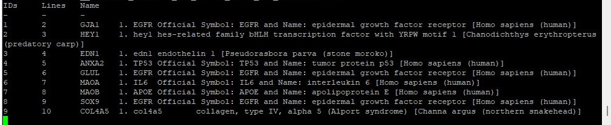

# p_Get_LOC.py user guide

This script requires the EDirect software to be installed on the computer as described by the [NCBI webpage](https://www.ncbi.nlm.nih.gov/books/NBK179288/). Once installed the script can be run like any python script using Python 3 (it was written and tested with Python 3.7.4).

Like the application, the script reads a character delimited text file, splitting each line in to a series for fields using a user selected character and then searcher the NCBI Gene data set for the terms in the user selected field. 

**Note**: If your file is a tab delimited text file, the entered character has to be '\t'. However, this may not be processed correctly and you may have to change line 10 in the script from   
> splitCharacter = sys.argv[3]  

to

> splitCharacter = "\t"

## Command
 A typical command is:

 > python p_GetLoc.py Deseq2_names.csv Deseq2_names_descriptions.txt , 9

 (**Note** the file's paths were omitted to ease of reading)

 Where
 * python - instructs the computer its a python script
 * p_GetLoc.py - is the name of the script
 * Deseq2_names.csv - the name of the file containing the terms
 * Deseq2_names_descriptions.txt - the name of the file to save the data too (if the file exists it will be overwritten)
 * **,** - the character used to split each line in to individual fields
 * 9 - The index of the field used to search the Gene data set (Index values start at 1)

 If the index is larger then the number of fields in a line the term will be set to **-** and ignored. Similarly, SYMBOL or RefSeq  terms are also ignored as they are probably the column titles.

 As the script runs it stores the returned data to the selected file and also prints the data to the terminal (Figure 1). The format of the exported data is indicated in Table 1.

 

Figure 1

|Search term|Gene Name|Description|
|-|-|-|
|LOC403585|1. LOC403585|serum amyloid A1 [Canis lupus familiaris (dog)]|
|SLC35A2|1. slc35a2|solute carrier family 35 member 2 [Channa argus (northern snakehead)]|
|FZD6|1. fzd6|frizzled class receptor 6 [Pseudorasbora parva (stone moroko)]|
|HSP70|1. hspa9|heat shock protein 9 [Channa argus (northern snakehead)]|
|CSN2|1. CSN2|Official Symbol: CSN2 and Name: casein beta [Bos taurus (domestic cattle)]|
|EGF|1. egf|epidermal growth factor [Channa argus (northern snakehead)]|

Table 1

### Command in the python script
The command below is used to search the NCBI Gene dataset using the Python implementation of EDirect's edirect.pipeline process:
  
> esearch -db gene -query {name}[Gene Name] | efetch -format gdc  

**Points**:  
1. The text: {name} is replaced by the search term.  
2. The [Gene Name] limits the search to genes otherwise terms such as **CAT** return terms linked to the animal as well as to "catalase".