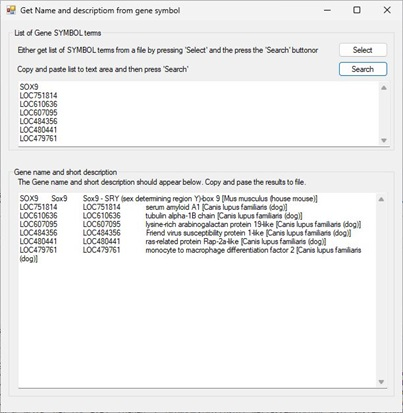
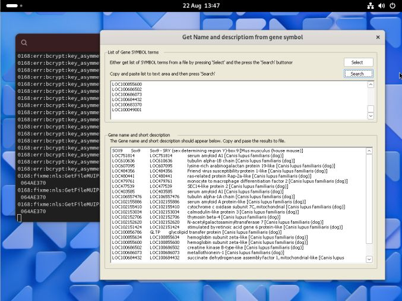

# Get LOC

This repository contains a desktop application and an independent Python script that allows you to search the NCBI Gene website for the gene name and brief description of a gene based on its gene SYMBOL or RefSeq accession ID. While the application and script duplicate each other's functions they work in different ways.

### Application: Get_LOC.exe
* Searchers the NCBI web site directly using this url -  
  https://www.ncbi.nlm.nih.gov/gene/?term={term}&report=docsum&format=text   
  (where {term} is replaced by the gene SYMBOL or accession ID)       
* This program has no dependances other than the .NET framework
* While primarily a Windows program it can run on a range of Linux and macOS computers with the aid of Wine ([website](https://www.winehq.org/) and [guide](https://github.com/msjimc/RunningWindowsProgramsOnLinux)) (Figure 2).

### Python script: p_Get_LOC.py   
* Searchers NCBI's Gene dataset using the Python implementation of EDirect using the ___edirect.pipeline___ process to run this command -   
> esearch -db gene -query {name}[Gene Name] | efetch -format gdc     

* The script requires that EDirect is installed in your computer.
* Since eDirect is targeted to Linux and macOS but can be run on WIndows with the Cygwin Unix-emulation environment.  

## Considerations
Neither method is fast; there are designed to process sequences that can't readily be annotated by other means and you should aim to process a limited dataset rather than all genes in a large dataset. This is important for the desktop application as NCBI monitors its webpage downloads and excessive use may lead to a temporary banning of your IP address.   

## Guide

* [User guide - Application](Guide/README.md) 
* [User guide - Script](Python%20script%20for%20eDirect//README.md) 

## Download
* [Compiled Desktop program](Program/)
* [Python script](Python%20script%20for%20eDirect/)

## Running on Linux and masOS

While Get_LOC.exe is targeted to run on Windows computers it is possible to run it on a range of Linux, BSD and Apple computers using Wine as described here:

* [Running Windows programs on Linux or masOS](https://github.com/msjimc/RunningWindowsProgramsOnLinux).

Figure 2: Get_LOC.exe running on Arch Linux

